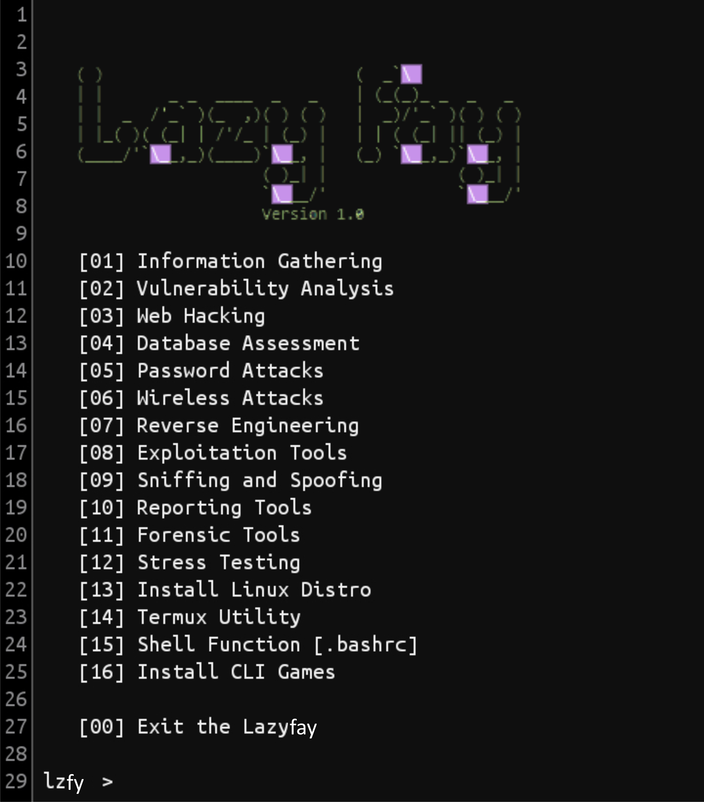

# Lazyfay
Lazyfay tools installer is very easy to use, only provided for lazy termux users, just kidding.
Lazyfay is a tool that is specially made for termux user which provides a lot of tool mainly used tools in termux, Lazyfay install any of the given tools provided by it from itself with just one click, and Lazyfay always get updated.

Made with ❤️

## Feature
- **Tool Installation**
Install Single Tool  
`lzfy > set_install 1`  
Install Multi Tool  
`lzfy > set_install 1 2 3 4`  
Install All Tool  
`lzmx > set_install @`  
- **Default Dir Install**
On `lazyfay.conf` replace symbol ~ with directory you want  
Example: lazyfay.conf  
`HOME = /sdcard`


## Screenshot


### Requirements
• Python 3.x

#### Installation and Using Lazyfay
```bash
apt install python git
git clone https://github.com/lazyfay/Lazyfayt
cd Lazyfay
python lazyfay.py
```

